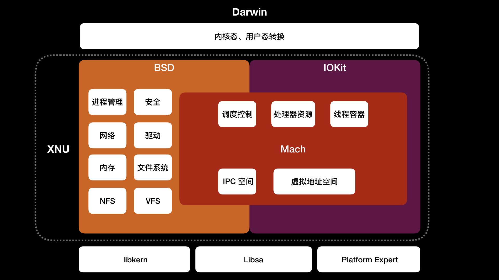

## iOS系统架构

iOS系统是基于ARM架构的，大致可以分为以下四层：

- 用户体验层，主要是提供用户界面，这一层包括SpringBoard、Spotlight、Accessibility
- 应用框架层，主要是开发者使用的，包含了开发框架Cocoa Touch
- 核心框架层，系统核心功能的框架层，包含了各种图形和媒体核心框架、Metal等
- Darwin层，操作系统的核心，属于操作系统的内核态，包含了内核XNU、驱动等

### XNU

XNU内部由Mach、BSD、驱动API IOKit组成，这些都依赖于libkern、libsa、Platform Expert。



其中，Mach是作为UNIX内核的替代，主要解决UNIX一切皆文件导致抽象机制不足的问题。Mach负责操作系统最基本的工作，包括进程和线程抽象、处理器调度、进程间通信、消息机制、虚拟内存管理、内存保护等

进程对应到Mach是Mach Task，包含虚拟地址空间、IPC空间、处理器资源、调度控制、线程容器

进程在BSD里是由BSD Progress处理，BSD Progress扩展了Mach Task，增加了进程ID、信号信息等，BSD Progress里面包含了扩展Mach Thread结构的Uthread

Mach的模块包括进程和线程都是对象，对象之间不能直接调用，只能通过Mach Msg进行通信，也就是mach_msg()函数。在用户态中，可以通过mach_msg_trap()函数触发陷阱，从而切到Mach，由mach_msg()函数完成实际通信

每个Mach Thread表示一个进程，是Mach里的最小执行单位。Mach Thread有自己的状态，包括机器状态、线程栈、调度优先级(有128个)、调度策略、内核Port、异常Port

Mach Thread既可以由Mach Task处理，也可以扩展为Uthread，通过BSD Progress处理，这是由于XNU采用微内核Mach和宏内核BSD的混合内核，具备两者的优点

- 微内核可以提高系统的模块化程度，提供内存保护的消息传递机制
- 宏内核在出现高负荷状态时依然能够让系统保持高效运作

Mach是微内核，可以将操作系统的核心独立在进程上运行，不过，内核层和用户层之间切换上下文和进程间消息传递都会降低性能。为了提高性能，苹果使用了BSD宏内核和Mach混合使用

宏内核BSD是对Mach的封装，提供进程管理、安全、网络、驱动、内存、文件系统(HFS+)、网络文件系统(NFS)、虚拟文件系统(VFS)、POSIX(Portable Operating System Interface of UNIX，可移植操作系统接口)。

BSD 提供了更现代、更易用的内核接口，以及 POSIX 的兼容，比如通过扩展 Mach Task 进程结构为 BSD Process。对于 Mach 使用 mach_msg_trap() 函数触发陷阱来处理异常消息，BSD 则在异常消息机制的基础上建立了信号处理机制，用户态产生的信号会先被 Mach 转换成异常，BSD 将异常再转换成信号。对于进程和线程，BSD 会构建 UNIX 进程模型，创建 POSIX 兼容的线程模型 pthread。

iOS6之后，为了增强系统安全，BSD实行了ASLR(Address Space Layout Randomization，地址空间布局随机化)。为了更好的利用多核，BSD加入了工作队列，支持多线程处理。BSD还从TrustdBSD引入了MAC框架以增强权限entitlement机制的安全

除了Mach和BSD外，XNU还有IOKit。IOKit是硬件驱动程序的运行环境，包括电源、内存、CPU等信息。IOKit底层libkern使用C++子集Embedded C++编写了驱动程序基类，比如OSObject、OSArray、OSString等，新驱动可以继承这些基类来写

#### XNU加载App的方式

1. fork进程
2. 为Mach-O分配内存
3. 解析Mach-O
4. 读取Mach-O头信息
5. 遍历load command信息，将Mach-O映射到内存
6. 启动dyld

iOS的可执行文件和动态库都是Mach-O格式，所以加载APP实际上是加载Mach-O文件

Mach-O header信息结构代码如下

```
struct mach_header_64 {
    uint32_t        magic;      // 64位还是32位
    cpu_type_t      cputype;    // CPU 类型，比如 arm 或 X86
    cpu_subtype_t   cpusubtype; // CPU 子类型，比如 armv8
    uint32_t        filetype;   // 文件类型
    uint32_t        ncmds;      // load commands 的数量
    uint32_t        sizeofcmds; // load commands 大小
    uint32_t        flags;      // 标签
    uint32_t        reserved;   // 保留字段
};
```

其中，文件类型filetype表示了当前Mach-O属于哪种类型。Mach-O包括以下几种类型

- OBJECT，指的是.o文件或者.a文件
- EXECUTE，指的是IPA拆包后的文件
- DYLIB，指的是.dylib或.frameword文件
- DYLINKER，指的是动态链接器
- DSYM，指的是保存有符号信息用于分析闪退信息的文件

加载Mach-O文件，内核会fork进程，并对进程进行一些基本设置，比如为进程分配虚拟内存、为进程创建主线程、代码签名等。用户态dyld会对Mach-O文件做库加载和符号解析

fork的相关代码在__mac_execve函数中

```
int __mac_execve(proc_t p, struct __mac_execve_args *uap, int32_t *retval)
{
    // 字段设置
    ...
    int is_64 = IS_64BIT_PROCESS(p);
    struct vfs_context context;
    struct uthread  *uthread; // 线程
    task_t new_task = NULL;   // Mach Task
    ...

    context.vc_thread = current_thread();
    context.vc_ucred = kauth_cred_proc_ref(p);

    // 分配大块内存，不用堆栈是因为 Mach-O 结构很大。
    MALLOC(bufp, char *, (sizeof(*imgp) + sizeof(*vap) + sizeof(*origvap)), M_TEMP, M_WAITOK | M_ZERO);
    imgp = (struct image_params *) bufp;

    // 初始化 imgp 结构里的公共数据
    ...

    uthread = get_bsdthread_info(current_thread());
    if (uthread->uu_flag & UT_VFORK) {
        imgp->ip_flags |= IMGPF_VFORK_EXEC;
        in_vfexec = TRUE;
    } else {
        // 程序如果是启动态，就需要 fork 新进程
        imgp->ip_flags |= IMGPF_EXEC;
        // fork 进程
        imgp->ip_new_thread = fork_create_child(current_task(),
                    NULL, p, FALSE, p->p_flag & P_LP64, TRUE);
        // 异常处理
        ...

        new_task = get_threadtask(imgp->ip_new_thread);
        context.vc_thread = imgp->ip_new_thread;
    }

    // 加载解析 Mach-O
    error = exec_activate_image(imgp);

    if (imgp->ip_new_thread != NULL) {
        new_task = get_threadtask(imgp->ip_new_thread);
    }

    if (!error && !in_vfexec) {
        p = proc_exec_switch_task(p, current_task(), new_task, imgp->ip_new_thread);

        should_release_proc_ref = TRUE;
    }

    kauth_cred_unref(&context.vc_ucred);

    if (!error) {
        task_bank_init(get_threadtask(imgp->ip_new_thread));
        proc_transend(p, 0);

        thread_affinity_exec(current_thread());

        // 继承进程处理
        if (!in_vfexec) {
            proc_inherit_task_role(get_threadtask(imgp->ip_new_thread), current_task());
        }

        // 设置进程的主线程
        thread_t main_thread = imgp->ip_new_thread;
        task_set_main_thread_qos(new_task, main_thread);
    }
    ...
}
```

由于Mach-O文件很大，函数会先为Mach-O分配一大块内存imgp，接下来会初始化imgp的公共数据。处理完成后，会通过fork_create_child()函数fork一个新的进程。新进程fork后，会通过exec_activate_image()函数解析加载Mach-O文件到内存imgp中。最后使用task_set_main_thread_qos()函数设置新fork出进程的主线程

exec_activate_image函数会调用不同格式对应的加载函数

```
struct execsw {
    int (*ex_imgact)(struct image_params *);
    const char *ex_name;
} execsw[] = {
    { exec_mach_imgact,     "Mach-o Binary" },
    { exec_fat_imgact,      "Fat Binary" },
    { exec_shell_imgact,        "Interpreter Script" },
    { NULL, NULL}
};
```

加载Mach-O文件的是exec_mach_imgact()函数。这个函数会通过load_machfile()函数加载文件，根据解析Mach-O后得到的load command信息，通过映射方式加载到内存中。还会使用activate_exec_state()函数处理解析加载后的结构信息，设置执行App的入口点

设置完后会通过load_dylinker()函数解析加载dyld，然后将入口点地址改成dyld的入口地址，之后就是用户态dyld加载App了

dyld的入口函数是__dyld_start，dyld属于用户态进程，不在XNU里，__dyld_start会加载App相关的动态库，处理完后会返回App的入口地址，然后到App的main函数
