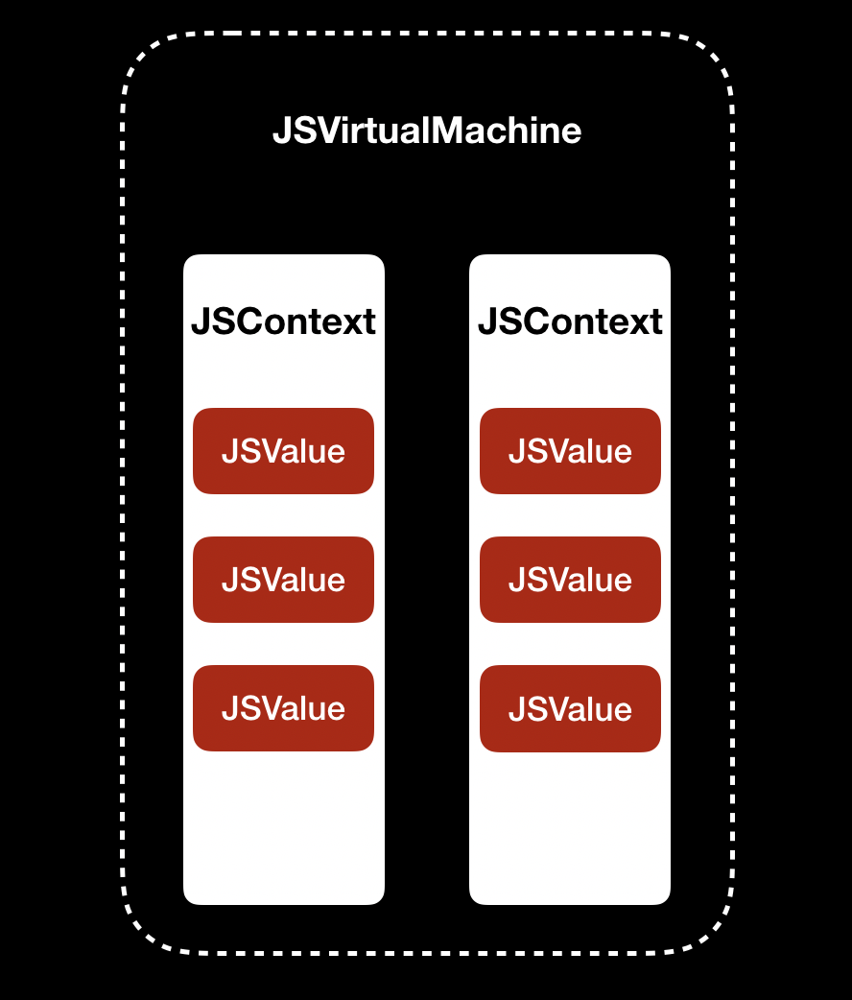

## UIWebView前端交互

### JaveScriptCore简介

JavaScriptCore，WebKit中用来解释执行JavaScript代码的核心引擎

目前解释JavaScript的引擎有很多种，苹果公司采用的是JavaScriptCore

iOS7之前，使用JavaScriptCore需要手动从开源的WebKit编译，它的接口都是用C语言，因此开发起来不友好

iOS7之后，苹果将JavaScriptCore引入系统，作为系统框架提供使用，使用Objective-C包装的接口就比较友好了

JavaScriptCore的框架名为JavaScriptCore.framework，[官方文档](https://developer.apple.com/documentation/javascriptcore?language=objc)，从结构上看，JavaScriptCore框架主要由JSVirtualMachine、JSContext、JSValue类组成

JSVirtualMachine的作用是为JavaScript代码的运行提供一个虚拟机环境。在同一时间内，JSVirtualMachine只能执行一个线程。想要执行多个线程，可以创建多个JSVirtualMachine。每个JSVirtualMachine都有自己的GC，所以多个JSVirtualMachine之间的对象无法传递

JSContext是JavaScript运行环境的上下文，负责原生和JavaScript的数据传递

JSValue是JavaScript的值对象，用来记录JavaScript的原始值，并提供进行原生值对象转换的接口方法

JSVirtualMachine、JSContext、JSValue之间的关系如下



每个JSVirtualMachine包含多个JSContext，一个JSContext中有包含多个JSValue

JSVirtualMachine、JSContext、JSValue类提供的接口，能够让原生应用执行JS代码，访问JS变量，访问和执行JS函数；也能让JS执行原生代码，使用原生输出的类

### 原生与前端交互


#### 原生调用JS

每个JavaScriptCore中的JSVirtualMachine对应一个原生线程，同一个JSVirtualMachine中可以使用JSValue与原生线程通信，遵循的是JSExport协议：原生线程可以将类方法和属性提供给JavaScriptCore使用，JavascriptCore可以将JSValue提供给原生线程使用

JavaScriptCore和原生应用交互首先要有JSContext，JSContext直接使用init初始化，会默认使用系统提供的JSVirtualMachine

如果JSContext要指定使用的JSVirtualMachine，可以使用initWithVirtualMachine

```
JSVirtualMachine *jsvm = [[JSVirtualMachine alloc] init];
JSContext *context = [[JSContext alloc] initWithVirtualMachine:jsvm];
[context evaluateScript:@"var i = 4 + 8"];
NSNumber *number = [context[@"i"] toNumber];
```

以下是使用JS函数的示例

```
[context evaluateScript@"function addition(x, y) {return x + y}"];
JSValue *addition = context[@"addition"];
JSValue *resultValue = [addition callWithArguments:@[@4, @8]];
```

JS的全局函数需要使用JSValue的invokeMethod:withArguments方法

#### JS调用原生

```
context[@"subtraction"] = ^(int x, int y) {
  return x - y;
};
JSValue *subValue = [context evaluateScript:@"subtraction(4, 8)"];
```

JS调用原生的方式如下

- 首先JSContext使用原生block设置一个函数
- 在同一个JSContext中用JS代码调用这个函数

除了block，还可以通过JSExport协议实现在JS中调用原生代码

### JavaScriptCore组成

JavaScriptCore内部是由Parser、Interpreter、Compiler、GC等部分组成，其中Compiler负责把字节码翻译成机器码，并进行优化，[官方文档](https://trac.webkit.org/wiki/JavaScriptCore)

JavaScriptCore解释执行的过程如下

1. 由Parser进行词法分析、语法分析，生成字节码
2. 有Interpreter进行解释执行，解释执行的过程先由LLInt(Low Level Interpreter)来执行Parser生成的字节码，JavaScriptCore会对运行频次高的函数或者循环进行优化。优化器有Baseline JIT、DFG JIT、FTL JIT。JavaScriptCore使用OSR(On Stack Replacement)来管理多优化层级切换

后续：[深入JavaScriptCore](https://ming1016.github.io/2018/04/21/deeply-analyse-javascriptcore/)
